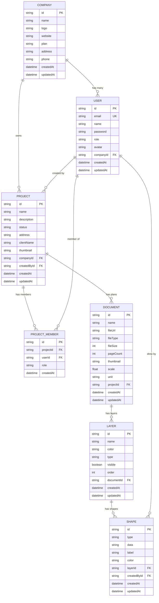
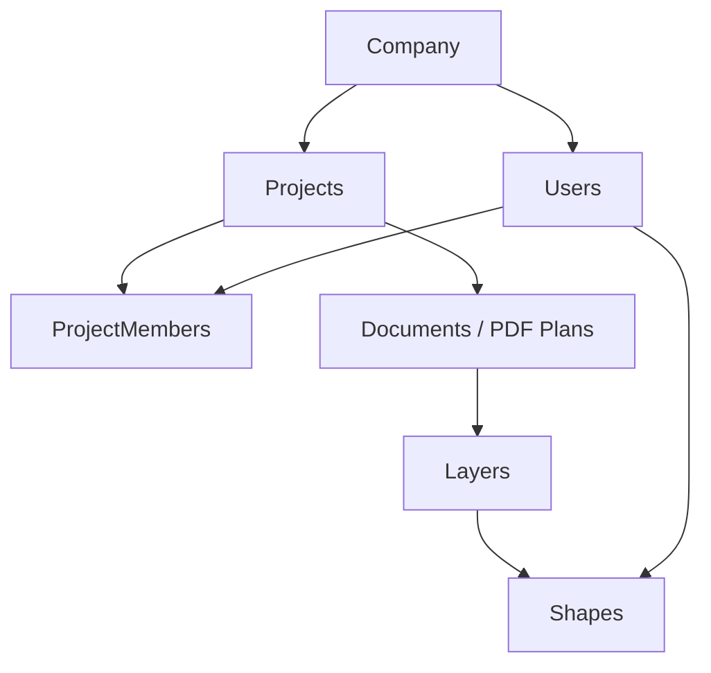
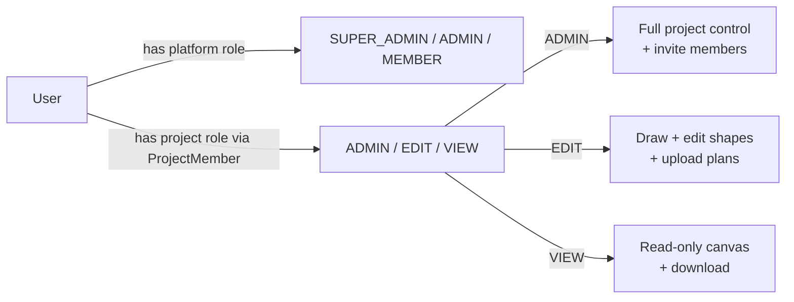
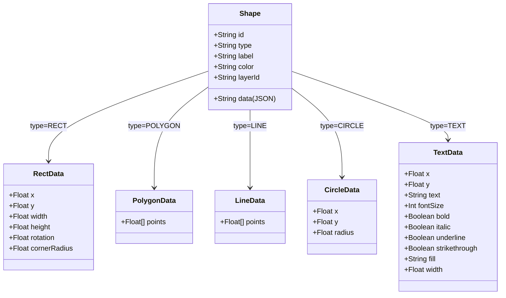

# ProTakeOff — Entity Relationship Diagram

> Rendered automatically by GitHub and many markdown editors (Mermaid support required).
> Paste this into [mermaid.live](https://mermaid.live) to see it rendered.

---

## Full ER Diagram

---

## Simplified Ownership Flow

---

## Access Control Flow

---

## Shape Data Formats

